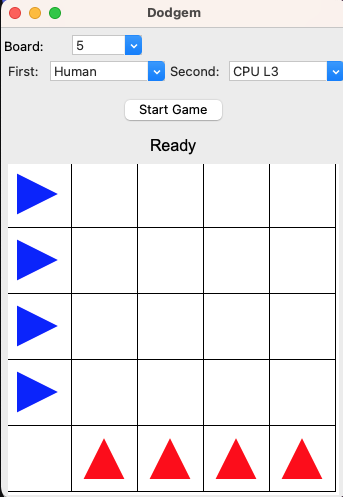

Dodgem is a Python package for playing and analyzing the board game **Dodgem**. It provides:

* A command-line interface to play games, build an offline MongoDB evaluation database by perfect analysis, and traverse the game tree
* Perfect-opponent play on 3×3, 4×4, and 5×5 boards using the MongoDB database with a simple Tkinter GUI
* A compact gzipped JSON file (a curated subset of the MongoDB database) that can be fully loaded into memory, eliminating the need for a large on-disk MongoDB instance
* A Python API for programmatic use
* An [online Dodgem page](https://sekika.github.io/dodgem/) that uses the JSON file

## Get started
- [Installation](installation)
- [Quickstart](quickstart)
- [Rules](rule)
- [CLI usage](cli)
- [GUI](gui)

## Deep dives
- [API reference](api)
- [Evalmap](evalmap)
- [MongoDB](database)
- [Configuration](configuration)
- [CPU levels](level)
- [FAQ](faq)

## Source code
- [GitHub](https://github.com/sekika/dodgem-py)
- Created by [sekika](https://github.com/sekika) aka Katsutoshi Seki. MIT license.

## Reference
- Berlekamp, Elwyn R.; Conway, John Horton; Guy, Richard K. (2003), “Dodgem,” Winning Ways for your Mathematical Plays, vol. 3 (2nd ed.), A.K. Peters, pp. 749–750, ISBN 978-1-56881-143-7.
- [Discussion thread, rec.games.abstract (1996)](https://ics.uci.edu/~eppstein/cgt/dodgem.html). David desJardins created win–loss tables for 4×4 and 5×5, concluding they are draws.
- [Wikipedia article](https://en.wikipedia.org/wiki/Dodgem)
